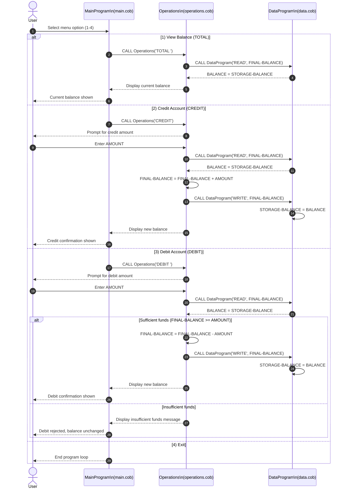

# Student Account COBOL Modules

This document describes the COBOL programs in `src/cobol/` and how they work together to manage a student account balance.

## Overview

The system is split into three programs:

1. `MainProgram` (`main.cob`) handles the user menu and routes actions.
2. `Operations` (`operations.cob`) applies business logic for balance checks, credits, and debits.
3. `DataProgram` (`data.cob`) provides balance storage and read/write access.

Program call flow:

`MainProgram` -> `Operations` -> `DataProgram`

## File Purposes And Key Functions

### `src/cobol/main.cob`

Purpose: Entry point and console menu loop for account management.

Key logic:

- Displays menu options:
  - `1` View Balance
  - `2` Credit Account
  - `3` Debit Account
  - `4` Exit
- Accepts user input into `USER-CHOICE`.
- Uses `EVALUATE` to call `Operations` with an operation code:
  - `TOTAL ` (note trailing space to fit `PIC X(6)`)
  - `CREDIT`
  - `DEBIT ` (note trailing space)
- Repeats until the user selects Exit.

### `src/cobol/operations.cob`

Purpose: Implements account transaction rules and delegates persistence to `DataProgram`.

Key logic:

- Receives an operation code through `PASSED-OPERATION`.
- For `TOTAL `:
  - Calls `DataProgram` with `READ`.
  - Displays current balance.
- For `CREDIT`:
  - Prompts for amount.
  - Reads current balance.
  - Adds amount to balance.
  - Writes updated balance.
  - Displays new balance.
- For `DEBIT `:
  - Prompts for amount.
  - Reads current balance.
  - Checks if balance is sufficient.
  - If sufficient, subtracts and writes updated balance.
  - If insufficient, displays an error and does not update stored balance.

### `src/cobol/data.cob`

Purpose: Stores and serves the account balance for the running program.

Key logic:

- Keeps balance in `STORAGE-BALANCE` (initialized to `1000.00`).
- Receives command in `PASSED-OPERATION` and amount/balance in `BALANCE`.
- For `READ`:
  - Moves `STORAGE-BALANCE` into `BALANCE` output.
- For `WRITE`:
  - Moves passed `BALANCE` into `STORAGE-BALANCE`.

## Student Account Business Rules

The current implementation enforces these rules:

1. Initial student account balance starts at `1000.00`.
2. Credits increase balance by the entered amount.
3. Debits are allowed only when `current balance >= debit amount`.
4. If funds are insufficient, no debit is posted and the balance remains unchanged.
5. Balance is held in-memory for the process lifetime (not persisted to file or database).
6. Operation codes must match fixed-width values (`PIC X(6)`), including trailing spaces where used.

## Notes And Constraints

- Amount and balance fields use `PIC 9(6)V99` (up to 6 integer digits and 2 decimals).
- Input validation is minimal:
  - Non-numeric or negative amount handling is not explicitly implemented.
  - Menu validation handles only out-of-range choices via `WHEN OTHER`.
- The implementation models a single account balance, which can represent one student account in its current form.

## Sequence Diagram

